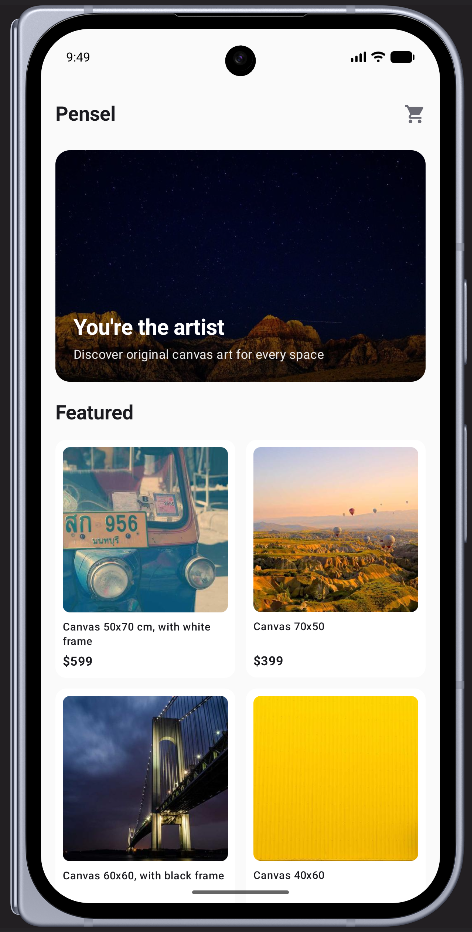
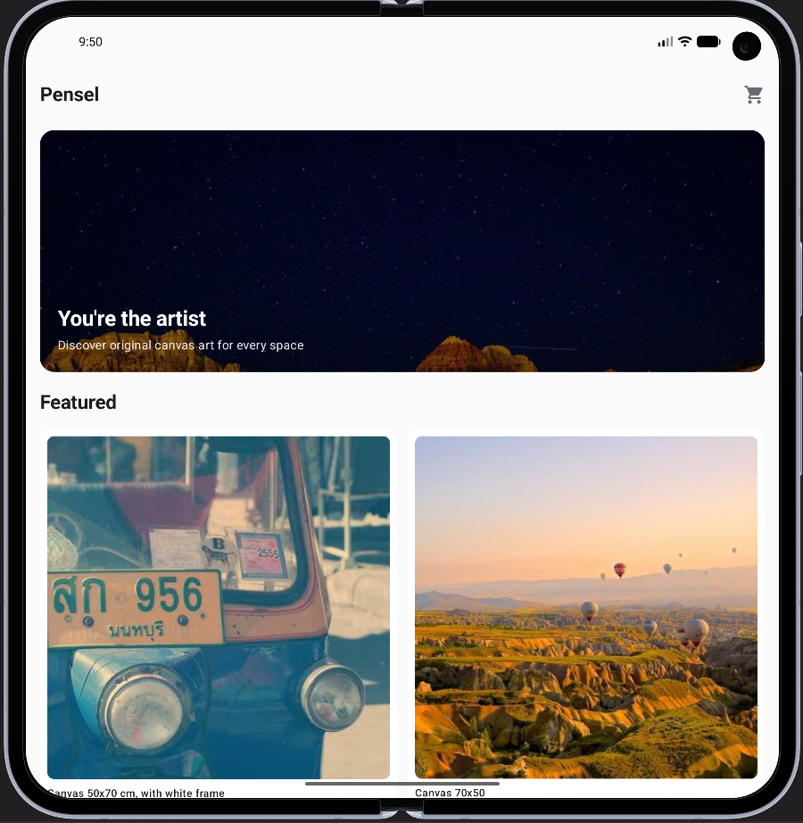

# Pensel — You're the artist

An Android e-commerce app for selling canvas art, built natively for foldable devices.

## Screenshots

| Closed | Opened |
| ------ | ------ |
|  |  |

## Features

- Home screen with hero banner and a grid of featured products
- Full catalog with a product grid (quick add-to-cart)
- Product detail screen (image, description, quantity, add to cart)
- Shared cart across screens (cart icon with item count badge)
- Checkout screen with delivery form, payment form, and order summary
- Full form validation (delivery and payment) with inline error messages
- Order confirmation dialog, cart automatically cleared after purchase
- Native foldable support — automatic layout switch between two postures
    - **CLOSED** — single-column vertical layout, collapsible order summary accordion
    - **OPENED** — two-column layout (form on the left, summary always visible on the right; image on the left, info on the right on the product detail screen)
- Adaptive light/dark theme based on system preference
- Prices displayed in USD ($)

## Tech Stack

- Kotlin 2.2.10
- Jetpack Compose (BOM 2026.02.01)
- AGP 9.4.0 / Gradle 9.6.0
- androidx.window for fold posture detection
- androidx.lifecycle (ViewModel + StateFlow) for state management
- androidx.navigation-compose for screen navigation
- Coil for image loading
- compileSdk/targetSdk 37, minSdk 24

## Architecture

- com.godark14.pensel/
    - data/
        - model/ → data models (Product, CartItem, DeliveryInfo, PaymentInfo)
        - mock/ → mocked repository (demo data, ahead of real API integration)
    - fold/ → fold posture detection (CLOSED/OPENED only)
    - ui/
        - home/ → home screen (banner, featured products)
        - catalog/ → catalog and product detail screens
        - cart/ → shared cart state across screens
        - checkout/ → checkout screen and its sections (delivery, payment, summary)
        - components/ → reusable UI components
        - navigation/ → NavHost and app routes
        - theme/ → Pensel theme (colors, typography, dark/light)
    - MainActivity.kt

## Roadmap

- API integration (Retrofit) to replace mocked data
- Real coupon code logic (currently decorative)
- Auto-formatting for the card number field

## License

This project is licensed under the MIT License — see the [LICENSE](LICENSE) file for details.